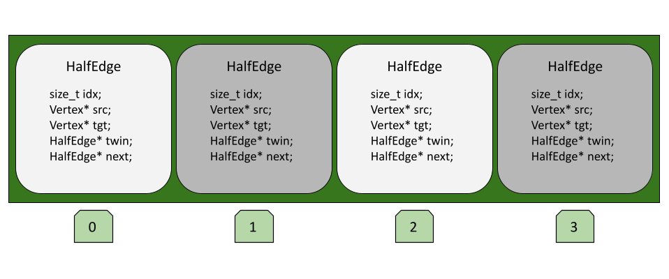
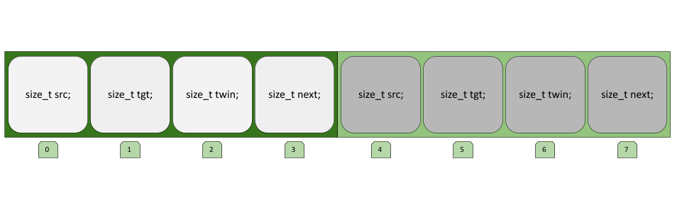

# Vertex Curvature Computation
This program computes the discrete Gaussian curvature (angle defect) at each vertex. So far, it only considers closed, manifold, and triangular meshes, and computes curvature linearly with standard C++20. 

## Building
First, clone the project using `git clone https://github.com/vaughnzaayer/gpu-curvature-computation.git`. Then, `cd` into the project directory and run the following to build:

```
cmake -B build
```
or to build with optimizations,
```
cmake -B build -DCMAKE_BUILD_TYPE=Release
```
Note that you will need the minimum requirements of C++20 and CMAKE version 3.21 or greater. To compile, run
```
cmake --build build
```

### Building with HIP and CUDA to use a GPU
First, ensure you have the HIP compiler [installed](https://rocm.docs.amd.com/projects/HIP/en/docs-6.0.0/how_to_guides/install.html), as well as NIVIDA's CUDA or AMD's ROCm, depending on your hardware. In the project's root directory, run
```
hipcc -std=c++20 -I include/ -o hip_main src/main.hip src/halfedge2.cpp
```

Then, run using `./hip_main [filename.obj]`.

To use purely CUDA, compile with this instead:
```
nvcc -std=c++20 -I include/ -o cuda_main src/main.cu src/halfedge2.cpp
```

Then, run using `./cuda_main [filename.obj]`.

## Running
To run the program, use
```
./build/linear_curvature_computation [filename.obj]
```
Without passing a filename, it will default to using `data/cube.obj`. Other options included are `data/bunny.obj` (which has 3300 vertices) and `data/cow.obj` (which has 400,000 vertices).

## Known Bugs
- The Gauss-Bonnet Theorem will read out as valid when compiled with HIP, but not with CUDA. However, the curvature values remain correct in both programs.
- A SEGFAULT will occur when the input size is too big (for example, `data/cow.obj` will cause the program to crash).

# Code Overview and Writeup

This program contains two notable components: a basic implementation of a halfedge data structure (HEDS) and GPU kernel code for computing vertex Gaussian curvature. The HEDS implementation can be found under [`include/halfedge2.hpp`](include/halfedge2.hpp) and [`src/halfedge2.cpp`](src/halfedge2.cpp). There are 3 `main` files: [`src/main.cpp`](src/main.cpp) (a basic linear vertex Gaussian curvature computation with a pointer-based HEDS), [`src/main.hip`](src/main.hip) (a GPU implementation of the algorithm using AMD's HIP), and [`src/main.cu`](src/main.cu) (the same GPU implementation but written in CUDA). Instructions for building and running the program are listed above.

## Discrete Vertex Gaussian Curvature

"Vertex Gaussian curvature" refers to the [angle defect](https://en.wikipedia.org/wiki/Angular_defect) around a vertex $i$, which is analogous to differential Gaussian curvature on a smooth surface. On a triangular mesh, computing the the curvature on a vertex only involves the edge lengths of the faces that include $i$. Assuming edge lengths have already been computed, the angle incident to $i$ on the neighboring face $f$ ($\theta_f^i$) can be computed using the Law of Cosines:
$$
\theta_f^i = \arccos(\frac{a^2+b^2-c^2}{2ab}),
$$
where $a, b$ are the lengths of the edges containing $i$ in the face $f$, and $c$ is the length of the edge opposite to $i$.

After computing $\theta_f^i$ for each face neighboring $i$ (we denote this set of faces as $\mathcal{F}_i$), we compute the vertex Gaussian curvature at $i$ as 
$$
K_i = 2\pi - \sum_{f \in \mathcal{F}_i} \theta_f^i.
$$

## The Halfedge Data Structure (HEDS)

To represent a mesh, I used a Halfedge Data Structure (HEDS). In a HEDS, a directional halfedge is used to connect vertices and denote orientation. Each vertex has a pointer to an outgoing halfedge. Halfedges themselves have pointers to the "next" halfedge, as well as their "twin."

Given a triangular face containing vertices $i,j,k$, we can assign the halfedges $\vec{ij}, \vec{jk}, \vec{ki}$ to give a consistent orientation of the face. For the halfedge $\vec{ij}$, $\vec{ij}$`.next` $= \vec{jk}$ and $\vec{jk}$`.next` $= \vec{ki}$, so successively accessing `.next` on a halfedge traverses the face. $\vec{ij}$`.twin` $= \vec{ji}$, which connects the same two vertices but in the opposite direction. 

With just these primitives, we can define an oriented mesh, as well as traverse it. In particular there are two operations we use to find $\mathcal{F}_i$. To find all outgoing edges from $i$, we track the initial $i$`.outgoingHE` and iteratively call `.twin.next` until we reach the initial edge again. Finding each face is similar --- for each outgoing halfedge of $i$, the second and third edges of each face are `.next` and `.next.next`, respectively. 

### Pointer- vs. Index-Based HEDS
A HEDS can come in two flavors: pointer-based and index-based. In a pointer-based structure, halfedges are referrenced directly by their memory address. This is pretty straightforward to implement, and allows us to leverage classes and structs in defining `Vertex` and `HalfEdge` objects. However --- as we will discuss later --- this implementation does not port easily to GPU memory architectures.

In an index-based HEDS, we keep arrays to store vertex and halfedge information in sequence. Then, these elements are referenced by their index in their respective arrays. A good description of this is given by the [Geometry Central implementation](https://geometry-central.net/surface/surface_mesh/internals/). Compared to using pointers directly, this requires more manual memory management, and is potentially less memory-efficient. Moving the data onto a GPU is much easier in turn, though.

## HEDS Implementation Overview
A high-level view of the HEDS can be found in [`include/halfedge2.hpp`](include/halfedge2.hpp). The three classes making up this HEDS are:
- `Triangulation`
    - Keeps a `std::vector` of all `Vertex` objects, and another for all `HalfEdge` objects.
    - An `std::unordered_map` to keep track of which vertices $i$, $j$ have a halfedge connecting them (in either direction).
    - More `std::vector` objects for keeping track of edge lengths and vertex curvatures.
    - A variety of `get` and `set` methods.
    - Method `Triangulation::loadFromObj()` for reading an `.obj` file using [tinyobjloader](https://github.com/tinyobjloader/tinyobjloader).
    - Methods for computing edge lengths and vertex curvatures.
- `HalfEdge`
    - Has a reference to its parent `Triangulation`.
    - The `HalfEdge`'s index.
    - Vertex indices for the source and destination vertices.
    - Halfedge indices for the twin and next halfedges.
    - A variety of `get` and `set` methods.
- `Vertex`
    - Has a reference to its parent `Triangulation`.
    - The `Vertex`'s index.
    - The index of an outgoing `Halfedge`.
    - `double` values to keep track of the vertex's `x`,`y`, and `z` coordinates in 3D Euclidean space ($\mathbb{R}^3$).
    - A variety of `get` and `set` methods.

We first instantiate a `Triangulation` object to manage the vertices and edges in a mesh. As long as the input is manifold and without boundary, `Triangulation` can use an `.obj` file to construct a HEDS for a mesh. To calculate the length of each halfedge, we iterate over each `HalfEdge` object in the `Triangulation`, then find the Euclidean distance between the coordinate positions of the source and destination vertices. Finding vertex curvatures is the same as described earlier --- use `halfedge.twin.next` and `halfedge.next` to find the adjacent faces, then compute the anfle defect. 

### Converting from Pointer-Based to Index-Based HEDS
Eventually, we will want to move parts of our `Triangulation` data to the GPU for parallel processing. Note that with a pointer-based structures, the addresses will not automatically line up when moved to the new GPU address space. Accessing class members or methods using `.` is also not possible on the GPU like on the CPU. Our solution is to "flatten" our data into standard C/C++ arrays, then copying those to and from the GPU. 

Here is a diagram for halfedges in the pointer-based HEDS. 



In order to access a halfedge's neighbor, for example, we would need to access the `HalfEdge* twin` member and dereference the pointer. Each index in the array also references an entire `HalfEdge` object. Here is a diagram of the "flattened" version.



## Using the GPU with HIP/CUDA

### Finding Edge Lengths on the GPU

### Finding Vertex Curvature on the GPU


### Debugging GPU Code


# Results and Further Directions
